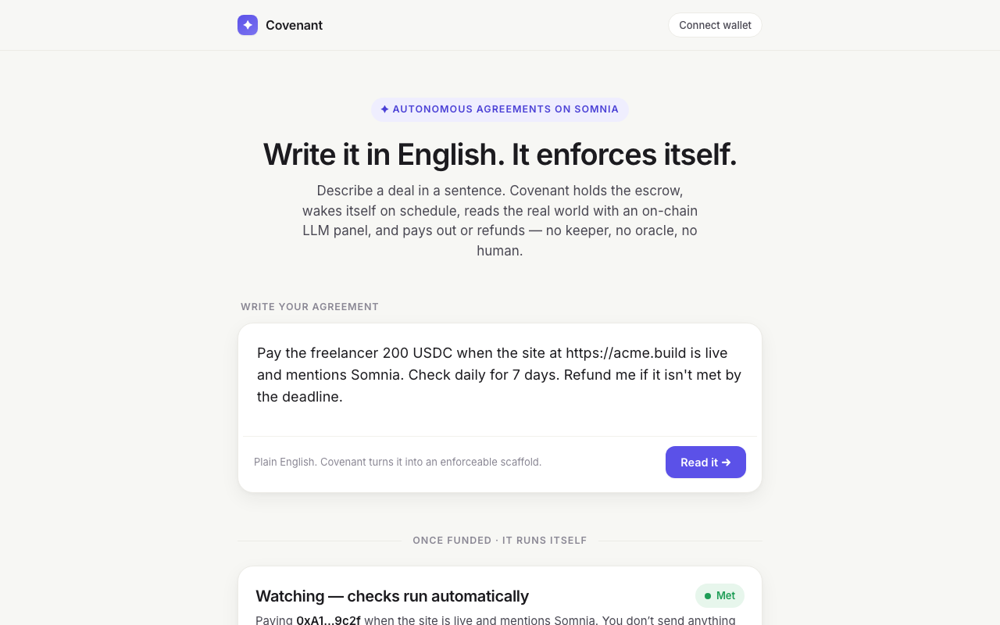
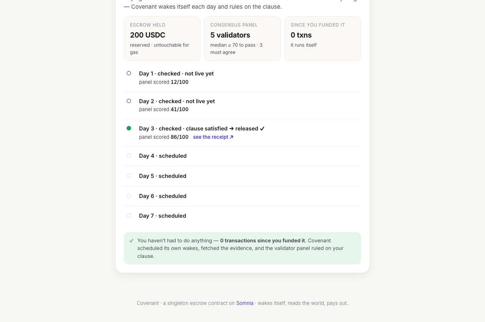

# Covenant: agreements that read the world and pay themselves

Escrow a plain-English deal once. The contract wakes itself, reads the evidence, rules on the clause, and moves the money. No keeper, no oracle, no human.

[](https://soliditylang.org/)
[](https://book.getfoundry.sh/)
[](https://nextjs.org/)
[]()
[](LICENSE)



## Live Demo

**[covenant-beta.vercel.app](https://covenant-beta.vercel.app)**
Write an agreement in English, confirm the extracted scaffold, and watch the bundled demo agreement enforce itself.

---

## What Is Covenant?

Covenant is a single standing smart contract on the [Somnia](https://somnia.network) Agentic L1. It holds escrow for agreements written in plain English and enforces them autonomously. You describe a deal in a sentence and fund it once. After that, zero transactions are sent to the contract: it schedules its own wakes, reads real-world evidence with an on-chain LLM agent panel, rules on the English clause by validator consensus, and releases the escrow or refunds you.

> Canonical demo: *"Pay the freelancer 200 USDC when the site at `<url>` is live and mentions Somnia. Check daily for 7 days. Refund me if it isn't met by the deadline."*

---

## Screenshots

| Write it in English | Watch it enforce itself |
|---|---|
|  |  |

---

## Why it's different

Most "smart" agreements force you to formalize fuzzy real-world conditions into brittle Solidity. Covenant doesn't. The enforcement clause stays in plain English, and the judge is an on-chain consensus LLM. At check-time a validator subcommittee independently reads the real evidence and scores the clause `0..100`. Covenant takes the median, so no single validator can swing a payout.

```
            write (English)            fund once                    then nobody touches it
 you  ────────────────────────►  Covenant escrow  ──────────────────────────────────────────►
                                      │   ▲
              scheduleSubscription… ──┘   │  (self-wake at the milestone time, no tx sent)
                                          │
                 ┌────────────────────────┴───────────────────────┐
   wake ─► perceive (LLM Parse Website) ─► judge (validator panel, median score)
                                          │
                       ├─ score ≥ threshold ─► release payout to payee
                       └─ past deadline unmet ─► refund the funder
                                          │
                       re-arm next milestone (reactive cascade)
```

Four primitives, one loop: **Wake → Perceive → Judge → Act**, with a viewable receipt for every judgment.

---

## Features

- **Plain-English clauses**: the enforcement condition is never compiled into Solidity. A validator LLM panel reads it at check-time.
- **Zero post-deploy transactions**: the contract arms its own wakes via Somnia's reactivity precompile and re-arms after every check.
- **Consensus judgment**: each check runs over a validator subcommittee with threshold consensus; the median score decides.
- **Walled-off escrow**: `reservedEscrow` accounting guarantees agreement funds are never spent on gas or agent fees.
- **Receipts for every ruling**: each judgment links to a per-validator receipt on the Somnia Agent Explorer.
- **Self-healing scheduling**: a thin gas buffer defers a re-arm instead of reverting a payout; anyone can recover it with `poke`.

---

## Tech Stack

| Layer | Technology |
|-------|-----------|
| Contracts | Solidity 0.8.30, Foundry, evm cancun |
| Chain | Somnia testnet (chain 50312) |
| Agents | Somnia agent platform: LLM Parse Website (judge), JSON API |
| Scheduling | `@somnia-chain/reactivity-contracts` (precompile `0x0100`) |
| Frontend | Next.js 14, viem/wagmi, TypeScript |

---

## How it works (on-chain)

- **Singleton + one buffer.** A single `Covenant` contract owns every schedule and holds one `≥ 32 STT` buffer. The subscription-owner minimum is a balance floor, not a per-subscription stake, so it never funds 32 STT per agreement.
- **Escrow is walled off.** `reservedEscrow` tracks every unsettled payout. Agent fees and reactive-tick gas are only ever paid from free balance (`balance − reservedEscrow`), keeping `≥ 32 STT + gas buffer` so escrow is never spent on gas.
- **Self-scheduling.** `scheduleSubscriptionAtTimestamp` (Somnia reactivity precompile `0x0100`) wakes the contract at each milestone time. `_onEvent` routes the wake to the right milestone by its millisecond timestamp.
- **Consensus judge.** Each check fires `createAdvancedRequest` to the LLM Parse Website agent (`ExtractANumber`, score `0..100`) over a validator subcommittee with threshold consensus. `handleResponse` aggregates the median and releases or refunds.
- **Safe callbacks.** Every agent callback verifies `msg.sender == platform` and handles all `ResponseStatus` values (`None/Pending/Success/Failed/TimedOut`). Settlement is checks-effects-interactions and is decoupled from scheduling: a thin buffer defers a re-arm (recoverable via the permissionless `poke`) rather than reverting a legitimate payout.

Built against the verified Somnia interfaces: agent platform (testnet `0x037Bb9C718F3f7fe5eCBDB0b600D607b52706776`), `@somnia-chain/reactivity-contracts`, `solc 0.8.30`, `evm_version = cancun`.

---

## Project Structure

```
covenant/
├── src/
│   ├── Covenant.sol            # the singleton: registry, escrow, scheduling, judge, payout, cascade
│   ├── IAgentPlatform.sol      # platform interface + Response/Request structs + enums
│   ├── IParseWebsiteAgent.sol  # LLM Parse Website agent surface (the judge)
│   ├── IJsonApiAgent.sol / ILlmAgent.sol   # generic agent surfaces (spine)
│   └── AgentProbe.sol / ReactiveWatcher.sol / InsuredProtocol.sol   # Phase-0 de-risk helpers
├── test/Covenant.t.sol         # milestone lifecycle, escrow math, refund, callbacks, defer/poke
├── test/AgentProbe.t.sol       # agent callback discipline (gating, median, status handling)
├── script/Deploy.s.sol         # deploy + fund the 32-STT buffer
├── script/derisk.sh            # testnet Stage A (agent leg) + Stage B (reactivity leg) runner
└── web/                        # frontend (Next.js + viem/wagmi), conversational "write-it-in-English" UI
```

---

## Running Locally

### Contracts

```bash
forge install foundry-rs/forge-std --no-git   # if lib/ is empty
npm install                                   # @somnia-chain/reactivity-contracts
forge build
forge test            # 23 passing: lifecycle, escrow/reservedEscrow math, refund, callbacks, defer/poke
```

### De-risk on testnet

```bash
cp .env.example .env   # add a funded testnet burner PRIVATE_KEY
./script/derisk.sh a   # Stage A: agent leg (~1 STT), prove createAdvancedRequest → handleResponse + receipt
./script/derisk.sh b   # Stage B: reactivity leg (~33 STT), prove a self-wake fires with no tx
```

### Deploy

```bash
forge script script/Deploy.s.sol:Deploy --rpc-url $RPC_URL --private-key $PRIVATE_KEY --broadcast
```

### Frontend

```bash
cd web
npm install
echo "NEXT_PUBLIC_COVENANT_ADDRESS=0x…" > .env.local   # optional; omit to view the bundled demo agreement
npm run dev   # http://localhost:3000
```

The UI: write an agreement in English → confirm the extracted scaffold (parties, escrow, milestone) → fund once → watch the self-running checks, panel scores, and receipt links on a calm timeline.

---

## Smart Contracts

| Network | Contract | Address |
|---|---|---|
| Somnia Testnet (50312) | Covenant | [`0x152432d1B863C0A0645D86452a23F9C16077C28A`](https://shannon-explorer.somnia.network/address/0x152432d1B863C0A0645D86452a23F9C16077C28A) |
| Somnia Testnet | Agent platform | `0x037Bb9C718F3f7fe5eCBDB0b600D607b52706776` |
| Somnia Testnet | LLM Parse Website agent | `12875401142070969085` |

Receipts: `https://agents.testnet.somnia.network/receipts/<requestId>`

**Proven on testnet (agent leg):** an `AgentProbe` consensus request resolved on Somnia testnet with 3 validators, median-aggregated, and a viewable receipt: [`/receipts/5358074`](https://agents.testnet.somnia.network/receipts/5358074). This is the exact `createAdvancedRequest → handleResponse → median` path Covenant's judge uses. (Reactivity leg + full singleton deploy need the ~33 STT buffer, pending a faucet/dev-grant top-up.)

---

## Security notes

- Callback gating + full `ResponseStatus` handling on every agent response.
- `reservedEscrow` invariant: escrow is never payable for gas or agent fees; the `32 STT` floor survives releases and refunds.
- Milestones are discrete stages, never a self-referential reactive filter (which would recurse and drain the buffer).
- No secrets in the repo; `.env` is gitignored. Testnet burner keys only.

Built for the **Somnia Agentathon**.

---

## License

MIT
